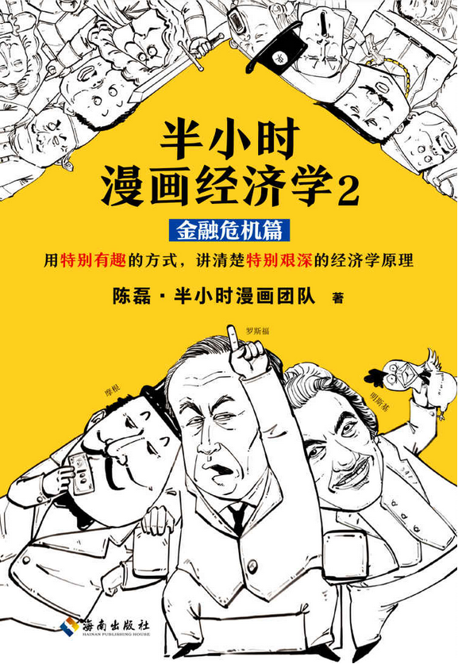
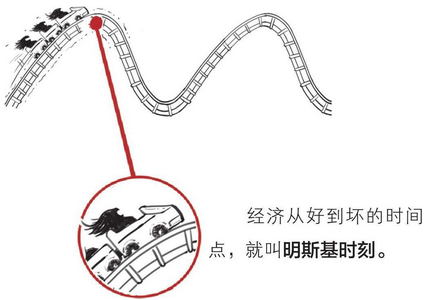
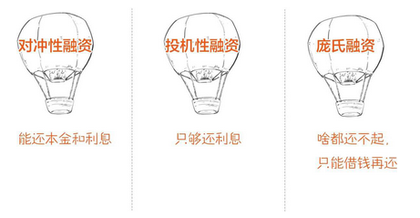

# 半小时漫画经济学
#### 生活常识篇

### 一、开篇:我们为什么学经济学
1.经济有个定义：**价值的创造、转化和实现。**

2.经济周期:

刚开始，人们很谨慎，尽量将资源放对地方，因此经济繁荣，生意兴隆，大家的日子美滋滋。

然而很快人们就得意忘形了，也不在意资源的配置是否发生了错位，结果就是经济出现危机，商店关门大吉，人们互相比谁惨。

### 二、金融危机就要来了：明斯基时刻

1.人们把这种周期性经济衰退的现象叫：**经济危机**。

2.海曼·明斯基，提出了“金融不稳定假说”。

简单地讲，经济越好人们越敢借钱搞投资。借钱多到还不起，玩脱了，金融危机就来了，经济危机也不远了。

等经济好不容易恢复了正常，人们又开始借钱投资，这个过程就像坐过山车一样，来来回回。

虽然表面看着经济不错，大家都有钱，但都是借的钱，万一还不上呢？风险很大有没有？

一旦出现这种情况，经济也就好到头了，这种拆东墙补西墙、到处借钱还钱的情况，跟庞氏骗局很像，所以叫**庞氏融资**。

借的这部分钱，就叫**杠杆**。借钱用来扩充资产，就是加杠杆。杠杆让你赚得多，但赔起来也多。

### 三、一朵花酿成的惨案：郁金香泡沫(上)

### 四、一朵花酿成的惨案：郁金香泡沫(下)
所以看完这个故事，对咱们还是很有用的，起码你再看到有些东西很贵，但明显不值那个价，人们却一直往里砸钱投资时，就应该知道那很可能就是金融泡沫，要保持冷静。价格虚高的东西别碰，要投就投有价值的，这叫理性。

### 五、连牛顿也算不出的疯狂：南海泡沫
南海泡沫就是这么个事情，但它给英国造成的影响不小。这里简单说两点：

影响 1：股份阴影

这场泡沫让英国人对股份公司产生了阴影，一提起股份公司就想起骗子——“南海泡沫”事件阻碍了英国股份制公司的发展，直到一个多世纪后英国人才走出阴影。

影响 2：英国政局

由于南海公司的事是托利党(后改称保守党)搞的，因此大家对它很失望。它的对头辉格党(后改称自由党)趁机上台，英国以后的政局就发生了变化。

### 六、股票连涨13个月会怎么样：密西西比泡沫

### 七、房价是怎么被炒起来的：1837年美国大恐慌

### 八、美联储的诞生：1907年美国银行危机
1.**信托**不复杂，混子哥简单科普一下：

土豪托尼有个女儿，他担心自己挂得早，女儿太小不懂事，管不了这么多钱——

于是托尼找了个信得过的人，把财产托付给他管着，女儿以后也算有了保障。

### 九、实现美国梦的三大法宝：泰罗制、福特制和猪

### 十、1929—1933年美国大萧条

### 十一、拯救美国的两位“救市主”：胡佛和罗斯福